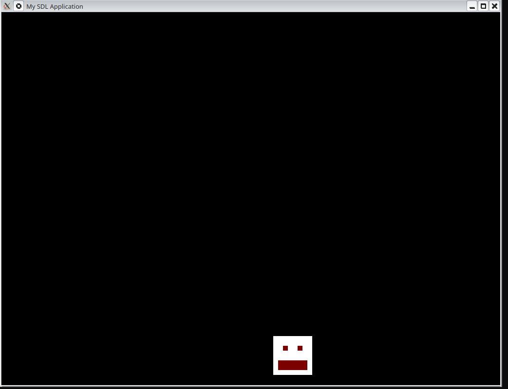
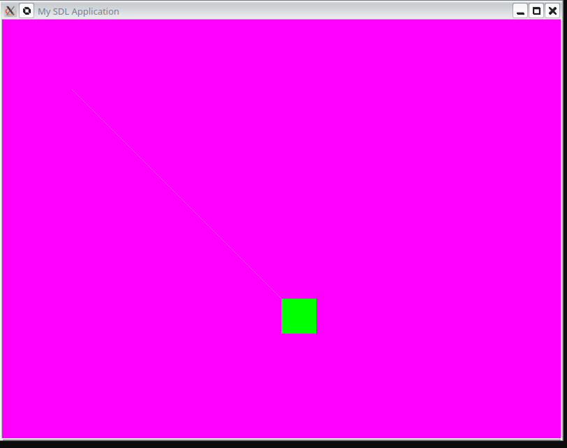

# Pong

## challenges 

- [X] Put something on screen 
- [X] Make it move with keyboard input
- [X] Make it move in a controlled fashion with timimgs 
- - Press w to increase speed of bouncing smiley face 
- - Press s to decrease speed of bouncing smiley face 

 

 


# 

an accurate time clock using [System.Clock](https://hackage.haskell.org/package/clock-0.8.4/docs/System-Clock.html)

```
haskell-pong.cabal 

  build-depends:  ...
   	              clock >= 0.8.4

```

```
import System.Clock (Clock(..), TimeSpec(..) , getTime, toNanoSecs , diffTimeSpec)

λ> a <- getTime Monotonic :: IO TimeSpec
λ> b <- getTime Monotonic :: IO TimeSpec
λ> a
TimeSpec {sec = 1628, nsec = 722611689}
λ> b
TimeSpec {sec = 1630, nsec = 700377224}
λ> toNanoSecs (diffTimeSpec a b)
1977765535
```


```
-- Safe conversion to Double for division
let nanosPerSec = 1_000_000_000 :: Double

let fps = 1.0 / (fromIntegral diff / nanosPerSec)
```

```
-- 1. Convert nanoseconds to seconds (as a Float or Double)
-- There are 1,000,000,000 nanoseconds in a second
let secondsPerFrame = fromIntegral diff / 1_000_000_000

-- 2. Invert to get Frames Per Second
let fps = 1 / secondsPerFrame

-- 3. (Optional) Round to 2 decimal places for display
let fpsRounded = realToFrac (round (fps * 100) :: Integer) / 100 :: Double

print fpsRounded
```
